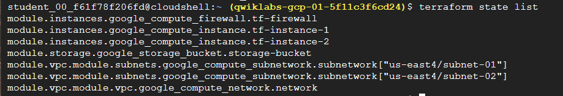
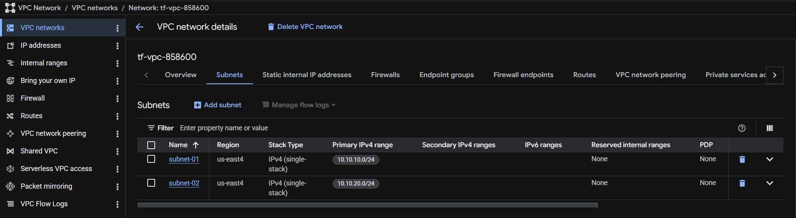
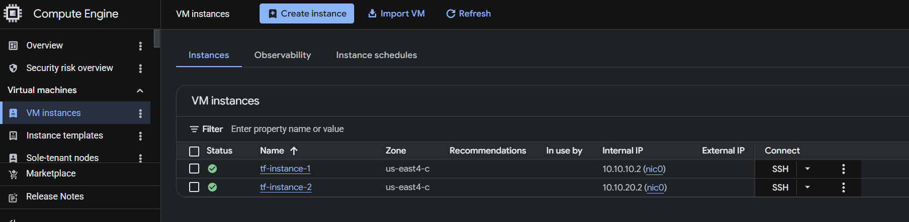
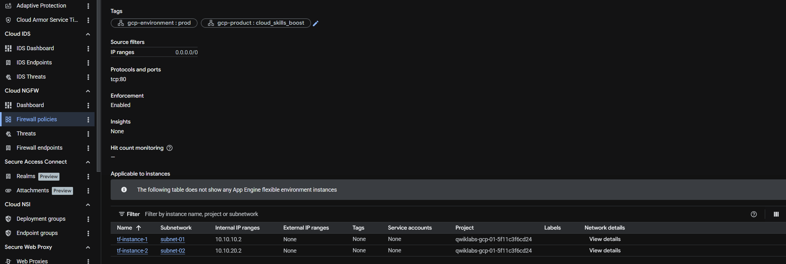
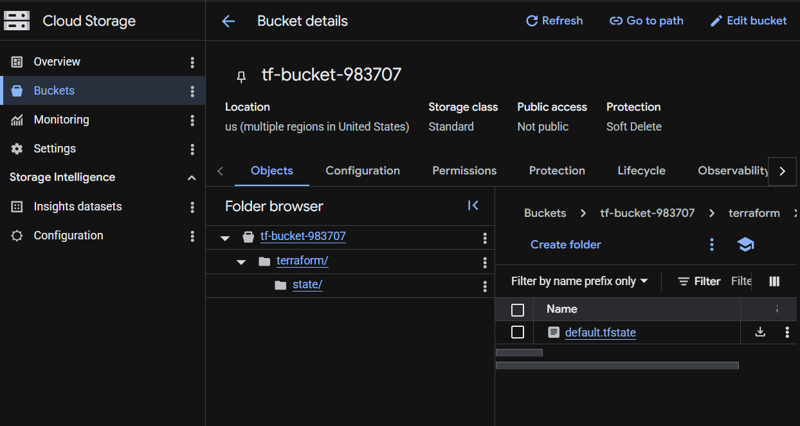
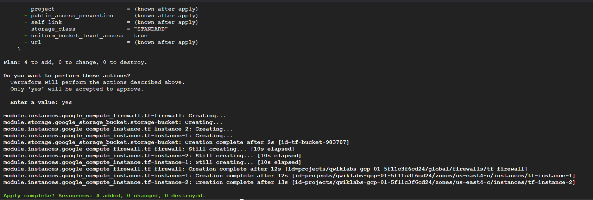

# GCP Infrastructure Automation with Terraform (Challenge Lab)

This repository contains the solution for a Google Cloud Challenge Lab focused on automating infrastructure using Terraform. The project demonstrates advanced skills in modularization, state management, and the lifecycle of cloud resources.

## 🏗️ Architecture Overview
The project involved building a multi-tier network and compute environment on Google Cloud Platform. 

### Key Technical Achievements:
*   **Infrastructure Import:** Successfully imported unmanaged VM instances into Terraform state.
*   **Remote Backend:** Implemented a Google Cloud Storage (GCS) bucket for persistent and shared state management.
*   **Modular Design:** Created custom modules for `instances` and `storage`, and utilized the official Terraform Registry Network module.
*   **Security Architecture:** Provisioned custom VPC subnets and configured ingress firewall rules for TCP port 80.

---

## 📊 Deployment Evidence

### 1. Resource Inventory & State Management
Verified the complete lifecycle management of all resources through the Terraform CLI.

**Command:** `terraform state list`


### 2. Network Infrastructure
Provisioned a custom VPC with isolated regional subnets using the Terraform Registry.
*   **Network Name:** `tf-vpc-858600`
*   **Subnet 01:** `10.10.10.0/24`
*   **Subnet 02:** `10.10.20.0/24`



### 3. Compute Instances
Managed the modification of existing VM instances to meet updated hardware specifications (`e2-standard-2`) and connected them to the new custom subnets.



### 4. Firewall & Security Policies
Implemented an ingress firewall rule to permit web traffic (port 80) from any source across the VPC.



### 5. Remote Backend Implementation
To follow DevOps best practices, the `terraform.tfstate` file was migrated to a secure Cloud Storage bucket.



---

## 🛠️ Infrastructure as Code Implementation

### File Structure
```text
.
├── main.tf          # Root configuration, provider, and modules
├── variables.tf     # Global variables
└── modules/
    ├── instances/   # VM resource definitions
    └── storage/     # GCS bucket for remote state
```
### 🛠️ Key Terraform Commands

These commands represent the core workflow used to manage the infrastructure lifecycle during this project.


# 1. Initialize the working directory and download necessary providers/modules
```bash
terraform init
```

# 2. Import existing, unmanaged Google Cloud instances into the Terraform state
```bash
terraform import module.instances.google_compute_instance.tf-instance-1 tf-instance-1
terraform import module.instances.google_compute_instance.tf-instance-2 tf_instance-2
```
# 3. Preview and execute the actions required to reach the desired state
```bash
terraform apply -auto-approve
```
# 4. Verify the resources currently managed by the state file
```bash
terraform state list
```

### 🛡️ Disaster Recovery: State & Backend Restoration

During the deployment lifecycle, a "State Panicked" scenario occurred where the remote backend (GCS Bucket) was deleted while infrastructure was still partially active. This section details the recovery process used to regain control of the environment.

#### **The Challenge**
*   **Problem:** `terraform destroy` removed the state bucket `tf-bucket-983707`.
*   **Result:** Terraform lost its "memory," resulting in `404: Bucket Not Found` errors and preventing any further `plan` or `apply` operations.

#### **The Solution (Disaster Recovery Workflow)**
To restore the environment, I implemented a manual state rescue:
1.  **State Salvage:** Located the `errored.tfstate` emergency file created by Terraform during the crash.
2.  **Metadata Purge:** Cleaned the local environment (`rm -rf .terraform/`) to force Terraform to forget the broken remote link.
3.  **Local Re-Initialization:** Reconfigured the backend to `local` to allow Terraform to read the salvaged state file.
4.  **Infrastructure Re-Sync:** Re-applied the configuration to recreate the GCS bucket and reconcile the active VPC/VM resources.
5.  **Remote Migration:** Migrated the local state back to the newly created GCS bucket using `terraform init -migrate-state`.

#### **Final Verification**
The screenshot below shows the successful `terraform apply` after the recovery, confirming that all 7 resources are back under Terraform management.



---

### 💡 Infrastructure Best Practices Implemented
To prevent this scenario in a production environment, I have implemented the following safeguards in the code:

*   **Lifecycle Protection:** Added `prevent_destroy = true` to the GCS bucket resource to ensure the state backend cannot be accidentally deleted.
*   **Implicit Dependencies:** Used resource linking to ensure networking components are destroyed/created in the correct logical order.
  
